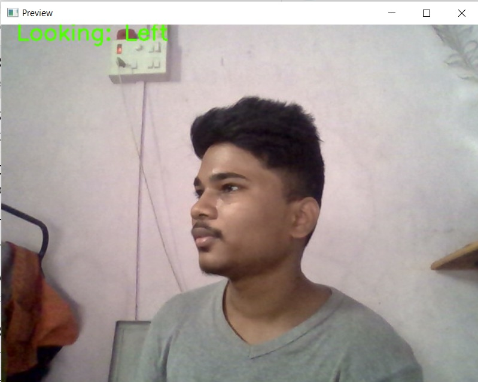
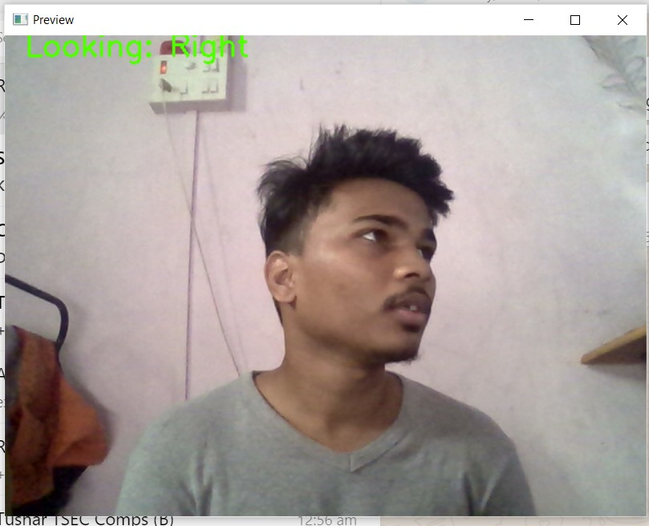
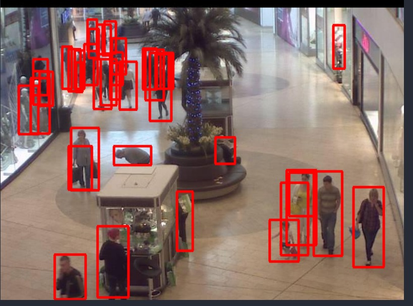

## SETUP :

_STEP 1 :_ Create a virtual environment in model folder

- Change working directory to model :

```bash
cd model
```

- Install virtualenv package if it is not installed already :

```bash
pip install virtualenv
```

- Create virtual environment :

```bash
virtualenv venv
```

_STEP 2 :_ Activate virtual environment :

```bash
venv\Scripts\activate
```

> This command need administrative permissions.
> Use command prompt to execute this
> Will not work in powershell

_STEP 3 :_ Install required libraries

```py
pip install -r requirements.txt
```

_STEP 4 :_ Run flask app

```bash
python app.py
```

---

After this the api will be up and running on : _localhost:8080_
You can now give api calls from react frontend.

API ROUTES :

1. '/predict_pose' : To predict head pose
2. '/predict_people' : To predict number of people in input image

NOTE :

- Both of these function takes as input a b64 encoded string which is sent via react webcam.
- For testing purposes you will find a sample encoded string of foward pose image given below in _sample_input.txt_ file .

---

## Results of face pose estimation model :

### LEFT POSE :



### RIGHT POSE :



### FORWARD :


NOTE :

> - Here we are detecting only 3 directions (forward, left , right) because that is all we need.
> - The number of detected directions can be increased.
> - To detect more directions go to draw annotations function in pose_estimator.py file and elif conditions for more angles.

```py
if angles[1] < -15:
    GAZE = "Looking: Left"
elif angles[1] > 15:
    GAZE = "Looking: Right"
else:
    GAZE = "Forward"
```

---

## Results of crowd couting model :

### SAMPLE1 :



### SAMPLE2 :


NOTE :

> The number of people detected can be changed via lowering the threshold
> To do that go to predict funtion in app.py and change the variable threshold
> Our default value is 0.5

```py
threshold = 0.5
```

---

- Original repo for pose-estimation-model 👉 [REPO_LINK](https://github.com/yinguobing/head-pose-estimation)
- Link for object detection model 👉 [MODEL_LINK](https://tfhub.dev/tensorflow/efficientdet/d0/1)
